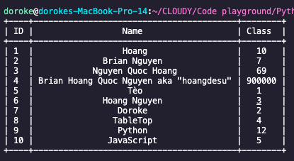

# TableTop

TableTop is a table formatter extension for the console.

    

<!--  -->

## Usage

* Clone the project
* Copy the class TableTop.py to your working directory
* <code>from TableTop import *</code>
* Create an object from TableTop class
* Voila!

## Methods

* <code>add_row()</code>: will add a row in form of a list to the table
* <code>print(myTable)</code>: will display the table

Further functionalities will be implemented in the futher

## Author
[Hoang Nguyen](https://www.facebook.com/Hoangdayo/)
